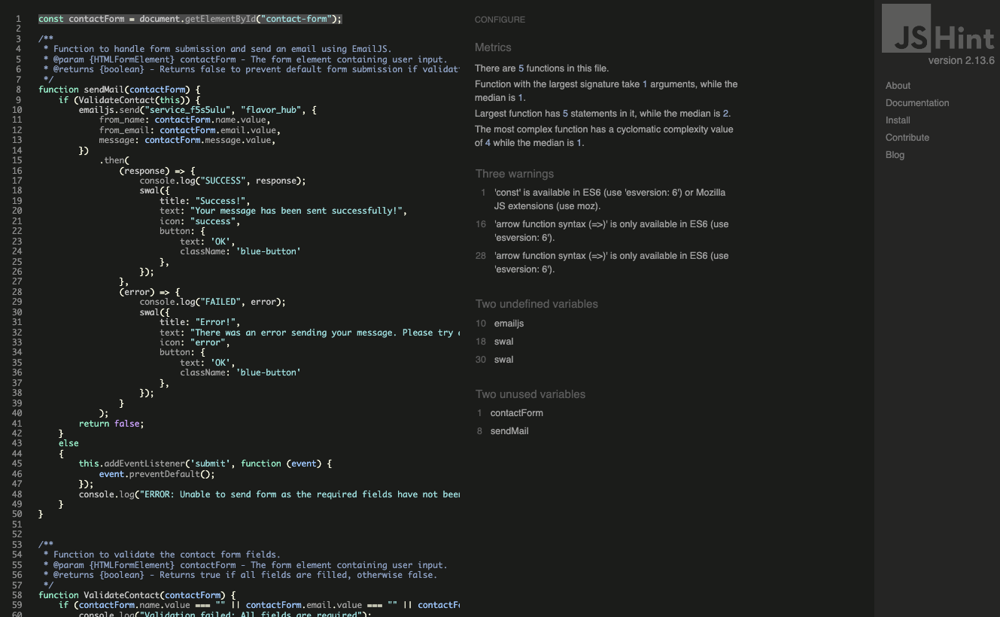
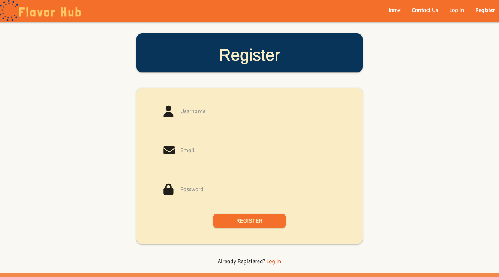

## Code Validation

### HTML Validation
I have used the recommended [W3C HTML Validator](https://validator.w3.org) to validate all of my HTML files. Below are the results for each HTML page:

| HTML File | Validator Link | Screenshot | Notes |
| --- | --- | --- | --- |
| `index.html` | [W3C Validator](https://validator.w3.org/nu/?doc=https%3A%2F%2Fflavor-hub-c7318789b1c4.herokuapp.com%2Findex) |  | No errors found |
| `register.html` | [W3C Validator](https://validator.w3.org/nu/?doc=https%3A%2F%2Fflavor-hub-c7318789b1c4.herokuapp.com%2Fregister) |  | No errors found |
| `login.html` | [W3C Validator](https://validator.w3.org/nu/?doc=https%3A%2F%2Fflavor-hub-c7318789b1c4.herokuapp.com%2Flogin) |  | No errors found |
| `contact.html` | [W3C Validator](https://validator.w3.org/nu/?doc=https%3A%2F%2Fflavor-hub-c7318789b1c4.herokuapp.com%2Fcontact) |  | No errors found |
| `recipe.html` | [W3C Validator](https://validator.w3.org/nu/?doc=https%3A%2F%2Fflavor-hub-c7318789b1c4.herokuapp.com%2Frecipe%2F66a7e0fbc693449982dd3934) |  | No errors found |
| `profile.html` | N/A |  | No errors found |
| `add_recipe.html` | N/A |  | No errors found |
| `edit_recipe.html` | N/A |  | No errors found |
| `add_category.html` | N/A |  | No errors found |
| `edit_category.html` | N/A |  | No errors found |
| `admin_dashboard.html` | N/A |  | No errors found |
| `403.html` | N/A |  | No errors found |
| `404.html` | N/A |  | No errors found |
| `500.html` | N/A |  | No errors found |

### CSS Validation

I have used the recommended [CSS Jigsaw Validator](https://jigsaw.w3.org/css-validator) to validate all of my CSS files. Below are the results:

| File | Screenshot | Notes |
| --- | --- | --- |
| `style.css` |  | No errors found |

### JavaScript Validation

I have used [JSHint](https://jshint.com/) to validate all of my JavaScript files, configured to allow ES6 syntax. Below are the details:

| File | Screenshot | Notes |
| --- | --- | --- |
| `script.js` |  | ES6 syntax validated, no critical errors found |
| `email.js` |  | ES6 syntax validated, no critical errors found |

### Python Validation

I have used the recommended [PEP8 CI Python Linter](https://pep8ci.herokuapp.com) to validate all of my Python files.

| File | CI URL | Screenshot | Notes |
| --- | --- | --- | --- |
| `app.py` | [CI Python Linter](https://pep8ci.herokuapp.com/https://raw.githubusercontent.com/Lauren21717/flavor-hub/main/app.py) |  | No issues |
## Browser Compatibility

| Browser Tested | Intended Appearance | Intended Responsiveness |
| --- | --- | --- |
| Chrome | Good  | Good |
| Firefox | Good | Good |
| Safari  | Good | Good |

## Compatibility Testing

To ensure that the website is functional and visually consistent across various platforms, the site was tested on different devices (e.g., desktops, laptops, tablets, smartphones) and operating systems (e.g., Windows, macOS, iOS, Android).

- **Results**: The Home page displays correctly on desktops, laptops, and tablets. However, on smartphones, buttons on the Login, Register, and Contact pages were not centered on small screens.

### Page Alignment Issues and Fixes

| Page | Before | After |
| --- | --- | --- |
| `login.html` |  |  |
| `register.html`|  |  |
| `contact.html` |  |  |

### Device Responsiveness

| Device Tested | Site Responsive >= 700px | Site Responsive < 600px | Renders as Expected |
| --- | --- | --- | --- |
| Smartphones | N/A | Good | Good |
| Tablets | Good | N/A | Good |
| Laptops | Good | N/A | Good |
| Desktops | Good | N/A | Good |


## Lighthouse Audit

I've tested my deployed project using the Lighthouse Audit tool to check for any major issues.

| Page | Mobile | Desktop |
| --- | --- | --- |
| `index.html` |  |  |
| `register.html` |  |  |
| `contact.html` |  |  |
| `profile.html` |  |  |
| `add_recipe.html` |  |  |
| `edit_recipe.html` |  |  |
| `login.html` |  |  |
| `recipe.html` |  |  |
| `admin_dashboard.html` |  |  |
| `add_category.html` |  |  |
| `edit_category.html` |  |  |


## User Story Testing

### New Site 

| User Story | Screenshot |
| --- | --- |
| **As a new site user, I would like to see a clear logo and website name to remember the brand.** |  |
| **As a new site user, I would like to see a clear message about the web app’s purpose so that I can understand what the application is about.** |  |
| **As a new site user, I would like to see a navigation bar so I can navigate around the site.** |  |
| **As a new site user, I would like to easily sign up on the website, so that I can access personalized features like adding and editing recipes.** |  |
| **As a new site user, I would like to have a search bar to search for recipes.** |  |
| **As a new site user, I would like to see social media icons so that I can reach out to other sources.** |  |

## Returning Site Users

| User Story | Screenshot |
| --- | --- |
| **As a returning site user, I would like to log in securely, so I can manage my recipes.** |  |
| **As a returning site user, I would like to add a new recipe, so that I can share my favorite dishes with others.** |  |
| **As a returning site user, I would like to edit my existing recipes, so that I can update or improve them over time.** |  |
| **As a returning site user, I would like to delete a recipe I've added, so that I can manage my recipe collection.** |  |
| **As a returning site user, I would like to mark some recipes as my favorites so that I can easily find them later.** | Future Feature |
| **As a returning site user, I would like to see a community of other cooks and food enthusiasts so that I can learn more and share my experiences.** | Future Feature |
| **As a returning site user, I would like to make posts in the community so that I can share my cooking experiences and tips.** | Future Feature |
| **As a returning site user, I would like to comment on others' posts in the community so that I can engage in discussions and exchange ideas.** | Future Feature |
| **As a returning site user, I would like to view all the recipes I have added on one page so that I can easily manage them.** |  |
| **As a returning site user, I would like to log out to keep my session secure when using shared devices.** |  |
| **As a returning site user, I would like to have access to a dedicated page for each recipe where I can view and add detailed information about that recipe.** |  |
| **As a returning site user, I would like to be able to edit information on each specific recipe page to keep it accurate and up-to-date.** |  |

## Site Admin

| User Story | Screenshot |
| --- | --- |
| **As a site administrator, I would like to stay connected with users so that they can report any issues or provide feedback on user experience.** |  |
| **As a site administrator, I should be able to delete posts that violate community guidelines to ensure the site remains a safe and welcoming space.** | Future Feature |
| **As a site administrator, I should be able to view who created each post so that I can monitor content and user activity.** | Future Feature |
| **As a site administrator, I should be able to delete users who violate the rules to maintain a safe and respectful community.** |  |
| **As a site administrator, I need to manage and view user accounts effectively to maintain control over the user base and monitor activity.** |  |
| **As a site administrator, I should be able to direct users back to the homepage if they encounter a page that is not found (404 error).** |  |
| **As a site administrator, I should be able to redirect users to the homepage if they try to access a page that is forbidden (403 error).** |  |
| **As a site administrator, I should be able to handle internal server errors by redirecting users back to the homepage with an appropriate message (500 error).** |  |

## Defensive Programming

To ensure Flavor Hub's security, stability, and user-friendliness, several defensive programming techniques have been implemented:

1. Input Validation:
   - All user inputs are validated on both the client and server sides to prevent submission of malformed data.
   - Example: Recipe ingredients and steps are checked for minimum and maximum lengths to ensure proper content.

2. Authentication and Authorization:
   - User authentication is required to access specific features, such as adding or editing recipes.
   - Users are restricted to editing or deleting only their own recipes, ensuring data integrity and security.

3. Error Handling:
   - `Try-except` blocks are utilized to gracefully handle potential errors, preventing application crashes.
   - Custom error pages (404, 403, 500) provide clear and user-friendly messages to guide users when something goes wrong.

4. Confirmation:
   - Before any recipe deletion, a confirmation modal is displayed to the user to prevent accidental deletions.

5. Search Functionality:
   - The search bar does not accept empty input submissions.
   - Form validation prevents submission without input, and an appropriate error message is displayed to the user.

6. User Authentication Redirects:
   - Users attempting to access the dashboard without logging in are automatically redirected to an error page, maintaining the security of user data.


## Bugs

- **When adding a new recipe, the steps after step one won’t be inserted into the database.**

    - To address this issue, I double-checked my `script.js` and found a typo in the `name` attribute of the stepTextarea.

        From:

        ```javascript
        name: 'preparation_steps',
        ```

        To:

        ```javascript
        let stepTextarea = $('<textarea>', {
            id: 'step_' + stepCount,
            name: 'preparation_step',
            class: 'materialize-textarea',
            minlength: '5',
            maxlength: '200',
            required: true
        });
        ```

- **Time input field can be negative**  
  
    - To fix this bug, I set `min="1"` on both `add_recipe.html` and `edit_recipe.html`, preventing negative numbers in the input field.
    

- **Ingredients inputs overlap with the label**  
  
    - To fix this bug, I refactored the `input:text` to `textarea`.
    

- **Adding more ingredients input fields doesn’t allow typing sometimes**  
  
    - To fix this bug, I refactored the `input:text` to `textarea`.
    

- **Unable to type "Thai" in the cuisine input field**  
  
    - To fix this issue, I adjusted the `minlength` attribute from 5 to 3 in both `add_recipe.html` and `edit_recipe.html`.

    From:

    ```html
    <input id="cuisine" name="cuisine" minlength="5" maxlength="50" type="text" class="validate" placeholder="Optional">
    ```

    To:

    ```html
    <input id="cuisine" name="cuisine" minlength="3" maxlength="50" type="text" class="validate" placeholder="Optional">
    ```

    

- **In `admin_dashboard`, the edit category function is not working**

    - I discovered the issue was due to the `url_for` in `edit_category.html`'s cancel button.
    - To fix the bug, I changed `{{ url_for('get_categories') }}` to `{{ url_for('admin_dashboard') }}`.

    From:  
      
    To:  
    
